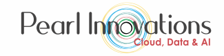
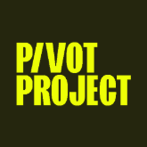

# AI Career Accelerator for Women: She Pivots AI Fellows Program

	<table>
		<tr>
			<td align="center" style="padding: 0 24px;">
				
			</td>
			<td align="center" style="padding: 0 24px;">
				
			</td>
		</tr>
	</table>
	
<em>Pearl Innovations Limited x Project Pivot</em>

This programme brings together Pearl Innovations Limited and Project Pivot to deliver the She Pivots AI Fellows Program.

The programme is a skills-building initiative designed to equip participants with practical AI knowledge, workplace-ready tools, and confidence to apply AI in real business settings. Pearl Innovations Limited supports the training of the Fellows by helping deliver the programme content, learning activities, and practical guidance throughout the course.

> **Duration:** 7 weeks

## Table of Contents

- [Format](#format)
- [Learning Outcomes](#learning-outcomes)
- [Week 1 - AI Foundations & Prompt Engineering](#week-1---ai-foundations--prompt-engineering)
- [Week 2 - AI for Everyday Business Productivity](#week-2---ai-for-everyday-business-productivity)
- [Week 3 - AI for Your Profession](#week-3---ai-for-your-profession)
- [Week 4 - AI Content Creation & Business Communication](#week-4---ai-content-creation--business-communication)
- [Week 5 - Building AI Agents (No Coding Required)](#week-5---building-ai-agents-no-coding-required)
- [Week 6 - Building AI Teams with OpenMax COCO AI](#week-6---building-ai-teams-with-openmax-coco-ai)
- [Week 7 - Career Readiness & Final Showcase](#week-7---career-readiness--final-showcase)
- [Weekly Commitments](#weekly-commitments)

## Format

- Weekly live workshop
- Self-paced labs
- Weekly assignments
- Weekly office hours/Q&A
- Capstone project
- Industry guest speakers (optional)

## Learning Outcomes

By the end of the programme, participants will be able to:

- Confidently use AI in everyday work
- Save several hours every week using AI
- Write effective prompts
- Create professional business content
- Analyse information with AI
- Build simple AI agents
- Use pre-built AI agents
- Automate common work tasks
- Develop an AI portfolio
- Be prepared for AI-enabled roles

## Week 1 - AI Foundations & Prompt Engineering

### Module 1: Understanding AI

Topics:

- What is AI?
- Generative AI vs traditional AI
- How large language models work
- AI myths and misconceptions
- Pre-built agents vs custom agents
- Responsible and ethical AI
- Privacy and security when using AI

### Module 2: Introduction to Prompt Engineering

Topics:

- Anatomy of a good prompt
- Giving context
- Assigning personas
- Using examples
- Refining prompts iteratively
- Common mistakes

### Hands-on Labs

Participants will:

- Create their first ChatGPT account
- Create a Claude account
- Create a NotebookLM account
- Compare answers from different AI tools
- Rewrite poor prompts into effective prompts
- Generate professional emails
- Summarise lengthy documents
- Translate content into different reading levels
- Create a weekly planner using AI

### Mini Project

"My Personal AI Assistant"

Each participant creates a reusable prompt library including:

- Email assistant
- Meeting assistant
- Learning assistant
- Research assistant
- Career assistant

Deliverable: Personal Prompt Library (25-30 prompts)

## Week 2 - AI for Everyday Business Productivity

### Module 3: AI for Business Productivity

- AI for communication
- AI for meetings
- AI for research
- AI for planning
- AI for presentations
- AI for document creation

### Hands-on Labs

Participants use AI to:

- Write business emails
- Draft meeting agendas
- Produce meeting minutes
- Create project plans
- Build PowerPoint presentations
- Generate reports
- Summarise PDFs
- Create action lists
- Analyse spreadsheets
- Build professional CVs

### Mini Project

Business Productivity Pack

Create:

- Professional CV
- Cover letter
- Presentation
- Project proposal
- Business report
- Weekly planner

## Week 3 - AI for Your Profession

Participants choose one specialization while exploring examples from other domains.

### HR

Labs:

- Create job descriptions
- Generate interview questions
- Screen CVs
- Prepare onboarding plans
- Draft performance reviews
- Create learning plans

Mini Project:

- Develop an AI-powered recruitment toolkit.

### Marketing

Labs:

- Social media posts
- Content calendars
- Blog writing
- Email campaigns
- Customer personas
- Product descriptions
- SEO optimisation

Mini Project:

- Develop a one-month marketing campaign for a small business.

### Sales

Labs:

- Sales emails
- Proposal generation
- Customer follow-up
- Objection handling
- CRM note generation
- Prospect research

Mini Project:

- Create an AI Sales Playbook with reusable prompts and templates.

### Finance

Labs:

- Budget summaries
- Financial report explanations
- Expense categorisation
- Invoice summaries
- Excel formula assistance
- Cash flow commentary

Mini Project:

- Create an AI Finance Assistant that supports month-end reporting.

### IT

Labs:

- Technical documentation
- User guides
- SQL query generation
- Code explanation
- Test case generation
- Troubleshooting knowledge base

Mini Project:

- Create an AI-powered IT Helpdesk Knowledge Assistant.

### Legal

Labs:

- Draft contracts, agreements, and legal correspondence using AI
- Summarise contracts and identify key clauses, obligations, and risks
- Generate compliance checklists and policy documents
- Research legislation, regulations, and case law to produce concise summaries
- Draft client emails, legal memos, and meeting notes
- Review legal documents for clarity, consistency, and plain English

Mini Project:

- Create an AI Legal Productivity Assistant

## Week 4 - AI Content Creation & Business Communication

### Module 4: Content Creation

- Professional writing
- Presentation design
- Image generation
- Video generation
- Business storytelling
- AI-assisted research

### Hands-on Labs

Participants create:

- PowerPoint presentation
- Infographic
- LinkedIn article
- Company newsletter
- Marketing flyer
- AI-generated images
- Short promotional video
- Training guide

Tools:

- ChatGPT
- Canva AI
- Microsoft Copilot
- Claude

### Mini Project

Create a complete product launch campaign including:

- Presentation
- Flyer
- LinkedIn post
- Promotional email
- One-minute promotional video
- Five AI-generated images

## Week 5 - Building AI Agents (No Coding Required)

### Module 5: Building AI Agents

- What is an AI agent?
- AI assistants vs AI agents
- When to use an AI agent
- Prompt-based agents
- Knowledge-based agents
- Multi-step AI workflows
- Responsible AI for business

Tools:

- ChatGPT (Custom GPTs - concept/demo, paid)
- Claude Projects (concept/demo)
- Microsoft Copilot Studio (trial/paid)
- Google NotebookLM (knowledge assistant)

### Hands-on Labs

Lab 1 - HR Agent
Answers employee policy questions, assists with onboarding, and drafts HR documents using uploaded HR resources.

Lab 2 - Marketing Agent
Generates social media posts, campaign ideas, blog content, and marketing emails based on campaign goals.

Lab 3 - Sales Agent
Drafts sales emails, follow-ups, proposal outlines, and researches prospective customers.

Lab 4 - Finance Agent
Summarises financial reports, answers finance policy questions, analyses expenses, and assists with budgeting and invoice enquiries.

Lab 5 - IT Helpdesk Agent
Answers technical support questions, generates troubleshooting guides, creates technical documentation, and assists with IT knowledge management.

Lab 6 - Legal Agent
Summarises contracts, drafts legal correspondence, generates compliance checklists, and answers questions using uploaded legal and policy documents.

### Mini Project

Design and demonstrate an AI agent for your chosen profession. Examples include:

- HR Policy Assistant
- Marketing Content Assistant
- Sales Proposal Assistant
- Finance Knowledge Assistant
- IT Helpdesk Assistant
- Small Business Advisor

Participants document the problem, knowledge sources, prompts, expected outputs, and business benefits.

## Week 6 - Building AI Teams with OpenMax COCO AI

### Module 6: AI Employees & Agent Teams with OpenMax COCO AI

- Introduction to AI employees and agent teams
- Human x Agent (HxA) collaboration
- AI assistants vs AI employees
- Creating role-based AI employees
- Building multi-agent workflows for business processes
- Agent memory, knowledge management, governance, and human review

Tools:

- COCO AI Agent Cloud (paid - trial/demo if available)

### Hands-on Labs

Lab 1 - HR AI Employee
Create an AI employee that answers HR policy questions, drafts job descriptions, assists with employee onboarding, and supports HR enquiries.

Lab 2 - Marketing AI Employee
Build an AI employee that generates campaign ideas, creates social media content, writes blogs, and prepares marketing calendars.

Lab 3 - Sales AI Employee
Develop an AI employee that researches prospects, drafts sales emails, prepares proposals, and recommends follow-up actions.

Lab 4 - Finance AI Employee
Create an AI employee that summarises financial reports, analyses expenses, drafts budget commentary, answers finance policy questions, and assists with invoice processing.

Lab 5 - IT AI Employee
Build an AI employee that answers technical support questions, generates troubleshooting guides, creates technical documentation, and assists with knowledge management.

Lab 6 - Legal AI Employee
Develop an AI employee that summarises contracts, drafts legal correspondence, generates compliance checklists, reviews policy documents, and assists with legal research.

### Mini Project

Design an AI Team for Your Business

Participants will design and demonstrate a collaborative AI team that solves a real business problem by assigning responsibilities to multiple AI employees.

Example AI teams include:

- HR Operations Team - Recruitment, onboarding, policy support, and employee learning
- Marketing & Communications Team - Campaign planning, content creation, social media, and customer engagement
- Sales & Customer Success Team - Lead qualification, proposal generation, follow-up, and customer support
- Finance Operations Team - Budgeting, invoice processing, expense analysis, and financial reporting
- IT Service Desk Team - Technical support, documentation, knowledge management, and incident assistance
- Legal & Compliance Team - Contract review, policy management, compliance monitoring, and legal research
- Small Business AI Office - HR, marketing, sales, finance, IT, legal, and customer support AI employees collaborating to manage day-to-day business operations

## Week 7 - Career Readiness & Final Showcase

### Module 6: Career Readiness

- AI in recruitment
- Building an AI portfolio
- AI-enhanced CVs
- Optimising LinkedIn with AI
- Interview preparation using AI
- Personal branding
- Continuous learning roadmap

### Hands-on Labs

Participants:

- Refine their CV with AI
- Optimise their LinkedIn profile
- Practise interview questions using AI
- Build a portfolio website or presentation
- Create a personal learning plan for the next 12 months

### Capstone Project

Each participant presents a practical AI solution to a real business challenge from their field. The presentation should include:

- The business problem
- Why AI was chosen
- The tools used
- Live demonstration
- Time and cost savings
- Risks and ethical considerations
- Future enhancements

# Weekly Commitments

## Detailed Breakdown

## Learning Philosophy

Each week follows a consistent pattern to build confidence and practical skills:

- Learn: Attend the daily 2-hour instructor-led session introducing concepts and demonstrating AI tools.
- Practice: Complete guided labs that reinforce the techniques using realistic workplace scenarios.
- Apply: Work on a role-specific assignment or mini project that solves a genuine business problem.
- Collaborate: Engage with peers and ask questions through ai-fellows-cohort-1 Slack Channel during dedicated support hours.
- Reflect: Document lessons learned, improve prompts, and add completed work to a professional AI portfolio.

## Participant Assessment Framework

| Activity | Hours/Week |
|---|---|
| Instructor-Led Learning | 10 hrs |
| Hands-on Labs & Practical Exercises | 10 hrs |
| Weekly Assignment & Mini Project | 5 hrs |
| Total Learning Commitment | 25 hrs/week |

| Day | Instructor-Led Session (2 hrs) | Self-Paced Learning (3 hrs) | Lecturer Support | Total |
|---|---|---|---|---|
| Monday | Weekly concepts, AI tool demonstrations & Q&A | Guided labs and practical exercises | ai-fellows-cohort-1 Slack Channel (up to 3 hrs) | 5 hrs |
| Tuesday | AI use cases, best practices & Q&A | Hands-on labs and scenario exercises | ai-fellows-cohort-1 Slack Channel (up to 3 hrs) | 5 hrs |
| Wednesday | New techniques & Q&A | Continue labs and begin mini project | ai-fellows-cohort-1 Slack Channel (up to 3 hrs) | 5 hrs |
| Thursday | Industry use cases, guest speaker or advanced demos & Q&A | Complete mini project and challenge exercises | ai-fellows-cohort-1 Slack Channel (up to 3 hrs) | 5 hrs |
| Friday | Project presentations, feedback & Q&A | Finalise and submit weekly assignment | ai-fellows-cohort-1 Slack Channel (up to 3 hrs) | 5 hrs |

| Assessment | When | Purpose | Weighting |
|---|---|---|---|
| Weekly Knowledge Checks | End of Each Week | Reinforce learning through short quizzes and practical exercises. | 20% |
| Weekly Mini Projects | Weeks 1-7 | Apply AI to real-world business scenarios and build a professional portfolio. | 40% |
| Capstone Project & Presentation | Final Week | Demonstrate an AI solution to a real business problem. | 40% |